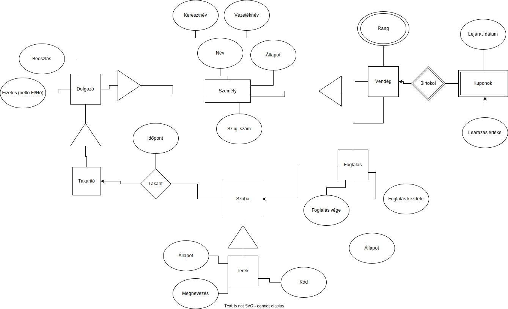

# Követelmények

- **A teljes követelmény lista a [adatbazisok_kovetelmenyek_TEA_2022.pdf](adatbazisok_kovetelmenyek_TEA_2022.pdf) fájlban van felsorolva.**
  - Próbáltam bele írni minden részhez egy 3-as teljesítésének követelményeit, de ez nem teljes.
- Random sablon valamelyik gyakvezírtűl: [mintadoksi.pdf](mintadoksi.pdf)
- Projekt ajánlott lépései (neten találtam, még nem teljesen aktulizáltam): [Projekt_lepesek.md](Projekt_lepesek.md)

## Követelmények röviden:

- min. 4 tábla
- tervezési dokumentáció
- EK diagram
- Leképezés
- Normalizálás
- MYSQL adatbázis kezelő rendszer
- min. 50 demó rekord összesen
  - Minden táblában legyen rekord
- CRUD
- legalább 3 összetett lekérdezés

## A programhoz a tervezési PDF dokumentáció az alábbiakat tartalmazza:

- A feladat megnevezése
- A feladat specifikációja, leírása
- Egyed-kapcsolat diagram és az egyed-kapcsolat diagram értelmezésének leírása
- Egyed-kapcsolat diagram leképezése relációs adatbázissémákká
- Relációsémák normalizálása 3NF-ig. (Amennyiben egy-egy séma esetén indokolt, a normalizálást elegendő csupán 2NF-ig megcsinálni).
- Táblatervek (a relációsémák alapján)
- Az összetett lekérdezések, amelyek az alkalmazásban is meg vannak valósítva.
- Megvalósítás (fejlesztő eszközök, nemtriviális megoldások).
- Az elkészült alkalmazás funkciói (legalább felsorolás szintjén)

-<>-<>-<>-<>-<>-<>-<>-<>-<>-<>-<>-<>-<>-<>-<>-<>-<>-<>-<>-<>-<>-<>-<>-<>-<>-<>-<>-<>-<>-<>-<>-<>-<>-<>-<>-<>-<>-<>-<>-<>-<>-<>-<>-<>-<>-<>-<>-<>-<>-<>

# `Hotel nyilvántartási rendszer` adatbázisok kötelező feladat

## Rendszerspecifikáció

Lorem ipsum dolor sit amet, consectetur adipiscing elit, sed do eiusmod tempor incididunt ut labore et dolore magna aliqua. Ut enim ad minim veniam, quis nostrud exercitation ullamco laboris nisi ut aliquip ex ea commodo consequat.

```
Ide egy tömör, 3-6 soros bekezdés kerüljön arról, hogy mire szolgál az adatbázis és a
program. A pirossal jelölt részeket kell megfogalmazni a saját munka alapján.
```

```
Követelmények:
 - Hiányos:
 - Részben jó:
 - Jó:
```

## Funkciók

- foglalások kezelése
  - ki mikorra, melyik szobát foglalta le
  - foglalás állapotának követése: megjelent, kijeletnkezett, aktív, stb.
- Vendégek adatainak nyilvántartása
  - Név, sz. ig szám tárolása és szerkesztése
  - Foglalásaik megtekintése
- Szobák nyilvántartása
  - Létre lehet hozni, szerkeszteni és törölni őket
  - Meg lehet nézni mikor lettek legutóbb kitakarítva és éppen lakik e valaki bennük
- Takarítók nyilvántartása
  - A takarítók adatait el lehet tárolni, szerekeszteni vagy törölni az adatbázisban
  - Meg lehet nézni és be lehet állítani, mikor és mit takarított az adott takarító

```
Meg kellene fogalmazni, hogy mit csinál az alkalmazás, milyen szolgáltatásokkal és
esetleges további, plusz funkciókkal rendelkezik, amelyek az alapelvárásokban nem [szerepelnek.
```

```
Követelmények:
 - Hiányos:
 - Részben jó:
 - Jó:
```

## Egyed-kapcsolat diagram



```
Az EK-diagramot mutató ábrának kell itt lennie.
```

```
Követelmények:
 - Hiányos: Ha az E-K diagram hiányzik, vagy nem szoftverrel készült.
 - Részben jó: A diagram elemei és felépítése többnyire jó, de vannak benne jelölésbeli hibák vagy hiányosságok.
 - Jó: A diagram elemei és felépítése a szabályos jelöléseknek megfelel.

Kiegészítő elemek:
  - Az E-K diagram tartalmaz gyenge egyedet, vagy specializáló kapcsolatot, és az helyesen lett leképezve relációs adatbázissémává.
```

## Egyed-Kapcsolat diagram leírása

Lorem ipsum dolor sit amet, consectetur adipiscing elit, sed do eiusmod tempor incididunt ut labore et dolore magna aliqua. Ut enim ad minim veniam, quis nostrud exercitation ullamco laboris nisi ut aliquip ex ea commodo consequat.

```
A diagramot magyarázó szövegnek kell itt szerepelnie.
```

```
Követelmények:
 - Hiányos: Ha az egyed-kapcsolat diagram nem felel meg az értelmezésének. Ha az értelmezésének leírása hiányzik. Ha a feladat kiírásának nem tesz eleget az adatbázismodell.
 - Részben jó: Az egyed-kapcsolat diagram értelmezése szerepel a dokumentációban, és tükrözi az adatmodellt.
 - Jó:  Az E-K diagram értelmezésének leírása tükrözi az egyed-kapcsolat diagramot.
```

## Relációs adatbázisséma

Személy(Keresztnév, Vezetéknév, _<u>Személyi igazolvány szám</u>_, Személy állapota)

Vendég(<u>Személyi igazolvány szám</u>, Vendég állapota)

Rang(<u>Személyi igazolvány szám</u>, Rang megnevezése)

Dolgozó(<u>Személyi igazolvány szám</u>, Dolgozó állapota, Dolgozó beosztása, Dolgozó fizetése)

Kupon(<u>Lejárati dátum</u>, <u>Leárazás értéke</u>, <u>Tulajdonos</u>, Kupon állapota)

Szoba(<u>Szobaszám</u>, Megnevezés, Szoba állapota, Legutóbbi takarító, Legutóbbi takarítás időpontja)

Foglalás(_<u>Foglalás száma</u>_, _Szobaszám_, Foglalás kezdete, Foglalás vége, Foglalás állapota)

Foglaló(<u>Foglalás száma</u>, <u>Személyi igazolvány szám</u>)

```
Ide a fenti EK-modell relációs adatbázissémára történő leképezésének eredménye
kerüljön! Ahol lehet, ott konszolidálni kell a sémákat (séma összevonások), de ezt
nem szükséges külön lépésben felírni, tehát elegendő rögtön a konszolidáció utáni
sémákat megadni. Ha valamilyen átalakítás külön magyarázatra szorul, azt javasolt
jelezni itt. A kulcsokat, külső kulcsokat minden sémában jelölni kell! A felírt sémák itt
már teljesítsék az 1NF-et, azaz a leképezéssel kapott sémákban legyen minden
attribútum atomi!
```

```
Követelmények:
 - Hiányos: Ha az E-K diagram hiányzik, akkor nincs mi szolgáljon a leképezés alapjául. Ha hiányzik a leképezés. Ha az E-K diagram leképezése nem valósult meg teljes mértékben.
 - Részben jó: Ha az E-K diagram leképezése hibás, vagy a kulcsok és külső kulcsok nem lettek kijelölve.
 - Jó: Ha az E-K diagram leképezése és kulcsok, külső kulcsok kijelölése helyes.

 Kiegészítő elemek:
 - Jó: Az adatbázis a lehetséges összevonások után legalább 6 relációsémából áll és azok helyesen lettek leképezve.
```

## Normalizálás

1. {Személyi igazolvány szám} -> {Vendég állapota, Személy állapota, Keresztnév, Vezetéknév, Dolgozó állapota, Dolgozó beosztása, Dolgozó fizetése, Rang megnevezése}

2. {Szobaszám} -> {Megnevezés, Szoba állapota, Legutóbbi takarító, Legutóbbi takarítás időpontja}

3. {Foglalás száma} -> {Szobaszám, Foglalás kezdete, Foglalás vége, Foglalás állapota, Személyi igazolvány szám}

4. {Lejárati dátum, Leárazás értéke, Tulajdonos} -> {Kupon állapota}

5. {Személyi igazolvány szám, Keresztnév} -> {Vezetéknév, Személy állapota}

6. {Személyi igazolvány szám, Dolgozó beosztása} -> {Dolgozó fizetése, Dolgozó állapota}

7. {Foglalás száma, Szobaszám} -> {Foglalás kezdete, Foglalás vége, Foglalás állapota}

8. {Személyi igazolvány szám, Rang megnevezése} -> {Rang megnevezése}

### Funkcionális függőségek

### Összes attribútum egy táblában

### Kulcsok

### 2NF

### 3NF

```
Sorba kell venni a második és harmadik normálformát (2NF, 3NF), és ellenőrizni,
hogy megfelelnek-e a fenti sémák ezeknek a kritériumoknak. Ha igen, akkor egy-egy
mondattal javasolt ezt megindokolni (a definíciók alapán). Ha nem, akkor el kell
végezni a szükséges átalakításokat a 2NF-re ill. 3NF-re hozáshoz, és felírni az ennek
során módosult ill. új sémákat.

Ezen a ponton én is bizonytalan vagyok. Két megoldást tudok elképzelni
  a) Össze kell vonni az összes táblát egybe, fell kell írni az összes attribútum funkcionális követelményeit és utána újra normalizálni 3NF-ig.
  b) Táblánkként fel kell írni a függőségeket aztán külön normalizálni a táblákat.
```

```
Követelmények:
 - Hiányos: Ha a relációsémák nincsenek 2NF normálformában.
 - Részben jó: Ha van olyan relációs adatbázisséma, amely nincs 2NF-ben sem. Ha van olyan tranzitív függés, amely nem lett megszüntetve a 3NF normálformára alakítással.
 - Jó: Ha minden relációs adatbázisséma legalább a 2NF normálformát teljesíti és minden lehetséges és értelmes tranzitív függés meg lett szüntetve a 3NF normálformára alakítással.
```

## Tábla tervek

```
A táblaterveknek megfelelő ábrákat kell itt feltüntetni vagy a táblákat létrehozó SQL
parancsok kódját kell ide másolni. Bizonyos adatbázis-kezelő alkalmazások grafikus
felületén van olyan funkció, amely a kívánt módon, tervezési nézetben rajzolja ki egy-
egy „dobozként” a táblákat.
```

```
Követelmények:
 - Hiányos:
 - Részben jó:
 - Jó:
```

## Összetett lekérdezések

```
A követelményekben említett három összetett lekérdezést kell leírni: röviden meg kell
fogalmazni, hogy melyik mit csinál, és meg kell adni az SQL kódjukat is. A
követelmények szerint az alábbi fajta nemtriviális lekérdezéseket kell készíteni:

„Legalább két olyan lekérdezés legyen, amelyben legalább két táblát kell
összekapcsolni és van benne csoportosítás és összesítés. Legalább egy
lekérdezésben allekérdezés szerepeljen."

Fontos, hogy ezeket a lekérdezéseket be kell építeni az alkalmazásba!
```

```
Követelmények:
 - Hiányos: Ha nincsenek feltüntetve az alkalmazásban használt lekérdezések.
 - Részben jó: -
 - Jó: Ha fel vannak tüntetve az alkalmazásban használt lekérdezések.
```

## Megvalósítás, Technológia

A projekt a következő technológiákat/szoftvereket fogja használni a munka során:

- Egyszerű CloudLinux alapú Cpanel webtárhely MySQL adatbázissal
- PHP (backend)
- Bootstrap (frontend)
- Github szoftverprojekt menedzselő szolgáltatás
- VSCode IDE
- Git verziókövető (Github)

```
Itt le kellene írni a program elkészítéséhez felhasznált fejlesztő eszközöket
```

```
Követelmények:
 - Hiányos: Ha a dokumentációból hiányzik a megvalósításhoz szükséges eszközök leírása, felsorolása.
 - Részben jó: -
 - Jó: Ha a megvalósításhoz szükséges eszközök szerepelnek a dokumentációban.
```

Szeged, 2022
